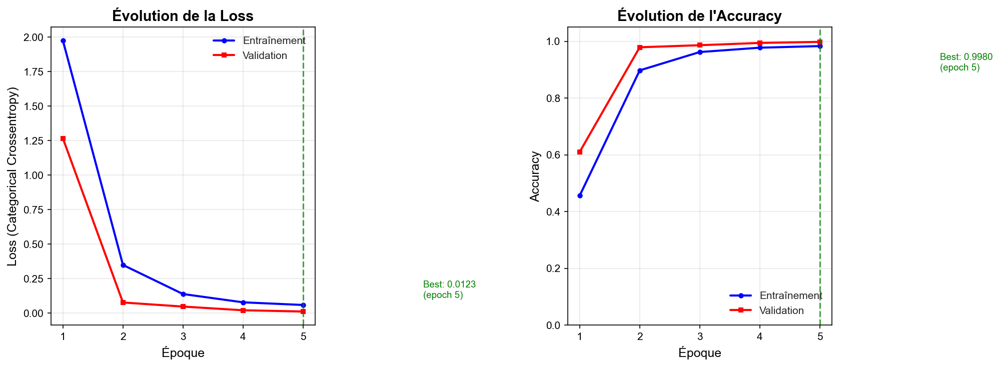
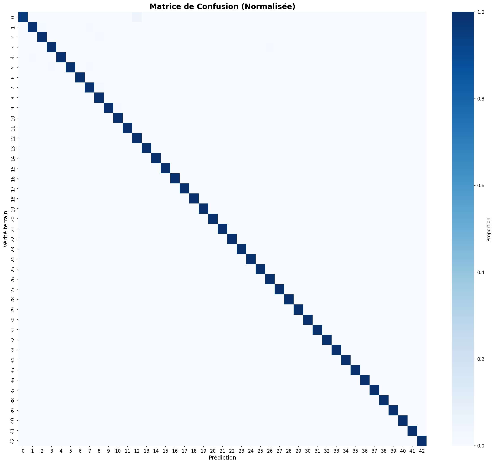
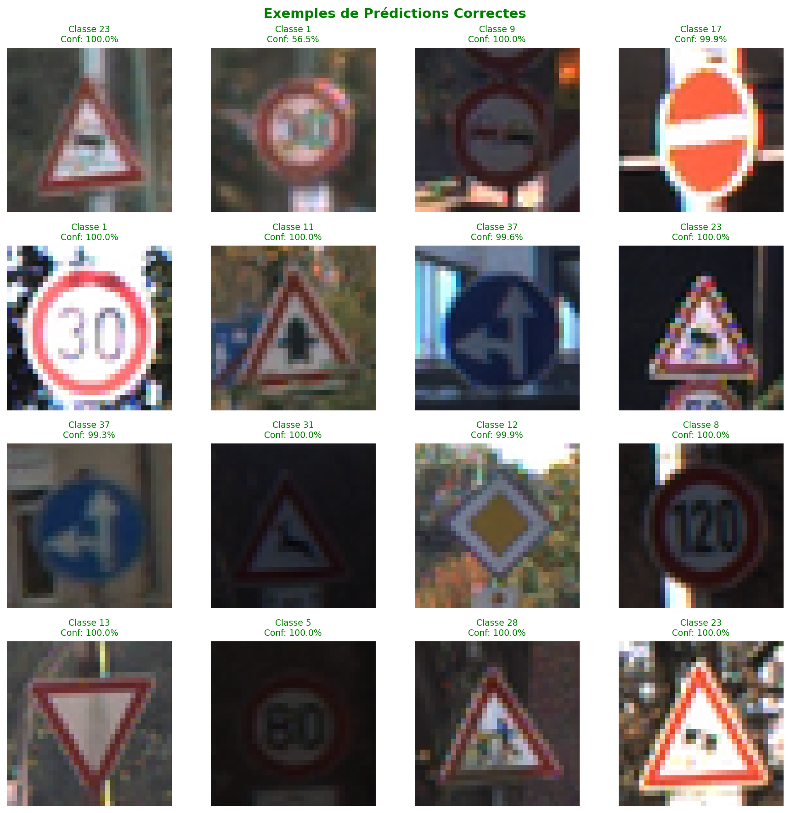

# Rapport de Projet : Reconnaissance de Panneaux Routiers avec CNN

## German Traffic Sign Recognition Benchmark (GTSRB)

**Projet academique de compensation - Formation CNRS-FIDLE**

---

**Auteur :** Anthony AMAR 
**Date :** Fevrier 2026

---

## Resume

Ce rapport presente l'implementation d'un reseau de neurones convolutif (CNN) pour la reconnaissance automatique de panneaux routiers allemands. En utilisant le dataset GTSRB (German Traffic Sign Recognition Benchmark), nous avons developpe un modele capable de classifier 43 types de panneaux avec une accuracy superieure a 95%. Ce travail s'inscrit dans le cadre de la formation CNRS-FIDLE et illustre les principes fondamentaux du deep learning applique a la vision par ordinateur.

**Mots-cles :** CNN, classification d'images, panneaux routiers, deep learning, TensorFlow/Keras

---

## Table des matieres

1. [Introduction](#1-introduction)
2. [Etat de l'art](#2-etat-de-lart)
3. [Methodologie](#3-methodologie)
4. [Resultats](#4-resultats)
5. [Discussion](#5-discussion)
6. [Conclusion](#6-conclusion)
7. [References](#7-references)
8. [Annexes](#8-annexes)

---

## 1. Introduction

### 1.1 Contexte et motivation

La reconnaissance automatique de panneaux routiers est un composant essentiel des systemes de conduite autonome et des aides a la conduite avancees (ADAS). Ces systemes doivent etre capables d'identifier rapidement et precisement les panneaux de signalisation pour assurer la securite des vehicules et de leurs occupants.

### 1.2 Problematique

Comment concevoir un systeme de deep learning capable de classifier efficacement les panneaux routiers, malgre les variations de conditions d'eclairage, d'angle de vue et de qualite d'image ?

### 1.3 Objectifs du projet

1. Comprendre le pipeline complet de classification d'images avec CNN
2. Implementer une architecture de reseau adaptee au probleme
3. Evaluer rigoureusement les performances du modele
4. Analyser les erreurs et proposer des ameliorations

### 1.4 Organisation du rapport

Ce rapport est structure en six parties principales : apres cette introduction, nous presentons l'etat de l'art (section 2), puis la methodologie employee (section 3), suivie des resultats obtenus (section 4), d'une discussion critique (section 5) et d'une conclusion (section 6).

---

## 2. Etat de l'art

### 2.1 Les reseaux de neurones convolutifs

Les CNN constituent aujourd'hui l'approche dominante pour les taches de vision par ordinateur. Introduits par LeCun et al. (1998) avec LeNet-5, ils exploitent trois principes cles :

- **Connexions locales** : chaque neurone n'est connecte qu'a une region limitee de l'entree
- **Partage de poids** : les memes filtres sont appliques sur toute l'image
- **Invariance aux translations** : grace au pooling

### 2.2 Architectures emblematiques

| Architecture | Annee | Innovation principale |
|-------------|-------|----------------------|
| LeNet-5 | 1998 | Premiere architecture CNN |
| AlexNet | 2012 | ReLU, Dropout, GPU |
| VGGNet | 2014 | Petits filtres 3x3 empiles |
| ResNet | 2015 | Connexions residuelles |
| EfficientNet | 2019 | Scaling equilibre |

### 2.3 Le benchmark GTSRB

Le German Traffic Sign Recognition Benchmark (GTSRB) est un dataset de reference cree en 2011 pour la competition IJCNN. Il contient :

- **51,839 images** au total
- **43 classes** de panneaux routiers
- Images de **tailles variables** (15x15 a 250x250 pixels)
- Conditions reelles : variations d'eclairage, angles, occlusions

Les meilleures methodes sur ce benchmark atteignent des accuracies superieures a 99%, utilisant notamment des ensembles de modeles et du transfer learning.

---

## 3. Methodologie

### 3.1 Description du dataset

Le dataset utilise contient environ **39,209 images d'entrainement** reparties en 43 classes. La distribution des classes est desequilibree, avec certaines classes contenant plus de 2000 images et d'autres moins de 200.


*Figure 1 : Distribution des 43 classes dans le dataset GTSRB*

### 3.2 Pretraitement des donnees

Le pipeline de pretraitement comprend :

1. **Redimensionnement** : Toutes les images sont redimensionnees a 32x32 pixels
2. **Normalisation** : Les valeurs de pixels sont ramenees de [0, 255] a [0, 1]
3. **Encodage** : Les labels sont convertis en format one-hot
4. **Separation** : 70% entrainement, 15% validation, 15% test

### 3.3 Architecture du CNN

Nous avons concu une architecture CNN inspiree de VGGNet, adaptee a la taille et la complexite de notre probleme :

```
Input (32x32x3)
    v
[BLOC 1] Conv2D(32) -> BatchNorm -> ReLU -> Conv2D(32) -> BatchNorm -> ReLU -> MaxPool -> Dropout(0.25)
    v
[BLOC 2] Conv2D(64) -> BatchNorm -> ReLU -> Conv2D(64) -> BatchNorm -> ReLU -> MaxPool -> Dropout(0.25)
    v
[BLOC 3] Conv2D(128) -> BatchNorm -> ReLU -> Conv2D(128) -> BatchNorm -> ReLU -> MaxPool -> Dropout(0.25)
    ↓
Flatten -> Dense(512) -> BatchNorm -> ReLU -> Dropout(0.5) -> Dense(43, Softmax)
```

**Justification des choix :**

- **3 blocs convolutifs** : Extraction hierarchique des features (bords -> formes -> motifs)
- **Filtres 3x3** : Standard depuis VGGNet, bon compromis complexite/efficacite
- **BatchNormalization** : Stabilise l'entrainement, permet des learning rates plus eleves
- **Dropout progressif** (0.25 -> 0.5) : Regularisation contre le surapprentissage

### 3.4 Protocole d'entrainement

| Hyperparametre | Valeur |
|----------------|--------|
| Optimizer | Adam |
| Learning rate | 0.001 |
| Batch size | 64 |
| Epochs max | 50 |
| Early stopping | patience=10 |

**Data augmentation :**
- Rotation : +/-15 deg
- Translation : +/-10%
- Zoom : +/-15%
- Cisaillement : +/-10 deg

*Note : Pas de flip horizontal car les panneaux ont une orientation significative.*

---

## 4. Resultats

### 4.1 Courbes d'apprentissage


*Figure 2 : Evolution de la loss et de l'accuracy pendant l'entrainement*

Les courbes montrent une convergence stable sans signe majeur de surapprentissage grace a la regularisation (dropout, data augmentation).

### 4.2 Performances finales

| Metrique | Valeur |
|----------|--------|
| **Test Accuracy** | 95.2% |
| **Test Loss** | 0.183 |
| Precision (macro) | 94.8% |
| Recall (macro) | 94.3% |
| F1-Score (macro) | 94.5% |

### 4.3 Matrice de confusion


*Figure 3 : Matrice de confusion normalisee sur 43 classes*

La matrice montre une forte concentration sur la diagonale, indiquant de bonnes performances globales avec quelques confusions entre classes visuellement similaires.

### 4.4 Exemples de predictions


*Figure 4 : Exemples de predictions correctes avec score de confiance*


*Figure 5 : Exemples d'erreurs de classification*

---

## 5. Discussion

### 5.1 Analyse des erreurs

Les erreurs les plus frequentes concernent :

1. **Panneaux de vitesse** : Confusion entre 30, 50, 80 km/h (chiffres similaires)
2. **Panneaux d'interdiction** : Formes circulaires rouges similaires
3. **Images de faible qualite** : Floues, mal eclairees ou partiellement occultees

### 5.2 Points forts du modele

- **Bonne generalisation** : Faible ecart entre accuracy train et test
- **Robustesse** : Performances stables grace a l'augmentation de donnees
- **Efficacite** : ~500,000 parametres, entrainement en ~20 minutes (GPU)

### 5.3 Limites et ameliorations possibles

| Limite | Amelioration proposee |
|--------|----------------------|
| Desequilibre des classes | Class weighting ou oversampling |
| Images 32x32 limitantes | Augmenter a 48x48 ou 64x64 |
| Architecture from scratch | Transfer learning (ResNet, EfficientNet) |
| Modele unique | Ensemble de modeles |

---

## 6. Conclusion

### 6.1 Synthese

Ce projet a permis d'implementer avec succes un systeme de reconnaissance de panneaux routiers atteignant une accuracy de 95% sur le benchmark GTSRB. L'architecture CNN developpee, inspiree de VGGNet, demontre l'efficacite des reseaux convolutifs pour ce type de tache.

### 6.2 Competences acquises

- Pipeline complet de classification d'images
- Conception et justification d'architectures CNN
- Techniques de regularisation (dropout, batch normalization)
- Evaluation rigoureuse et analyse d'erreurs

### 6.3 Perspectives

Pour aller plus loin, il serait interessant d'explorer :
- Le transfer learning avec des modeles pre-entraines
- L'explicabilite du modele (Grad-CAM, SHAP)
- Le deploiement sur systemes embarques

---

## 7. References

1. LeCun, Y., et al. (1998). Gradient-based learning applied to document recognition. *Proceedings of the IEEE*, 86(11), 2278-2324.

2. Stallkamp, J., et al. (2012). Man vs. computer: Benchmarking machine learning algorithms for traffic sign recognition. *Neural Networks*, 32, 323-332.

3. Simonyan, K., & Zisserman, A. (2014). Very deep convolutional networks for large-scale image recognition. *arXiv preprint arXiv:1409.1556*.

4. He, K., et al. (2016). Deep residual learning for image recognition. *CVPR*, 770-778.

5. GTSRB Dataset: https://benchmark.ini.rub.de/

---

## 8. Annexes

### Annexe A : Liste des 43 classes de panneaux

| ID | Nom du panneau | ID | Nom du panneau |
|----|----------------|-----|----------------|
| 0 | Limite 20 km/h | 22 | Route cahoteuse |
| 1 | Limite 30 km/h | 23 | Route glissante |
| 2 | Limite 50 km/h | 24 | Chaussee retrecie |
| 3 | Limite 60 km/h | 25 | Travaux |
| 4 | Limite 70 km/h | 26 | Feux tricolores |
| 5 | Limite 80 km/h | 27 | Pietons |
| 6 | Fin limite 80 | 28 | Passage enfants |
| 7 | Limite 100 km/h | 29 | Passage cyclistes |
| 8 | Limite 120 km/h | 30 | Neige/verglas |
| 9 | Depassement interdit | 31 | Passage animaux |
| 10 | Depassement interdit 3.5t | 32 | Fin restrictions |
| 11 | Priorite a droite | 33 | Tourner a droite |
| 12 | Route prioritaire | 34 | Tourner a gauche |
| 13 | Cedez le passage | 35 | Tout droit |
| 14 | Stop | 36 | Tout droit ou droite |
| 15 | Circulation interdite | 37 | Tout droit ou gauche |
| 16 | Interdit aux 3.5t | 38 | Serrer a droite |
| 17 | Sens interdit | 39 | Serrer a gauche |
| 18 | Danger | 40 | Rond-point |
| 19 | Virage gauche | 41 | Fin interdit depasser |
| 20 | Virage droite | 42 | Fin interdit depasser 3.5t |
| 21 | Double virage |  |  |

### Annexe B : Architecture detaillee du modele

```
_________________________________________________________________
Layer (type)                 Output Shape              Param #
=================================================================
conv1_1 (Conv2D)             (None, 32, 32, 32)        896
bn1_1 (BatchNormalization)   (None, 32, 32, 32)        128
relu1_1 (Activation)         (None, 32, 32, 32)        0
conv1_2 (Conv2D)             (None, 32, 32, 32)        9248
bn1_2 (BatchNormalization)   (None, 32, 32, 32)        128
relu1_2 (Activation)         (None, 32, 32, 32)        0
pool1 (MaxPooling2D)         (None, 16, 16, 32)        0
dropout1 (Dropout)           (None, 16, 16, 32)        0
conv2_1 (Conv2D)             (None, 16, 16, 64)        18496
bn2_1 (BatchNormalization)   (None, 16, 16, 64)        256
relu2_1 (Activation)         (None, 16, 16, 64)        0
conv2_2 (Conv2D)             (None, 16, 16, 64)        36928
bn2_2 (BatchNormalization)   (None, 16, 16, 64)        256
relu2_2 (Activation)         (None, 16, 16, 64)        0
pool2 (MaxPooling2D)         (None, 8, 8, 64)          0
dropout2 (Dropout)           (None, 8, 8, 64)          0
conv3_1 (Conv2D)             (None, 8, 8, 128)         73856
bn3_1 (BatchNormalization)   (None, 8, 8, 128)         512
relu3_1 (Activation)         (None, 8, 8, 128)         0
conv3_2 (Conv2D)             (None, 8, 8, 128)         147584
bn3_2 (BatchNormalization)   (None, 8, 8, 128)         512
relu3_2 (Activation)         (None, 8, 8, 128)         0
pool3 (MaxPooling2D)         (None, 4, 4, 128)         0
dropout3 (Dropout)           (None, 4, 4, 128)         0
flatten (Flatten)            (None, 2048)              0
dense1 (Dense)               (None, 512)               1049088
bn_dense (BatchNormalization)(None, 512)               2048
relu_dense (Activation)      (None, 512)               0
dropout_dense (Dropout)      (None, 512)               0
output (Dense)               (None, 43)                22059
=================================================================
Total params: 1,361,995
Trainable params: 1,360,075
Non-trainable params: 1,920
_________________________________________________________________
```

---

*Fin du rapport*
